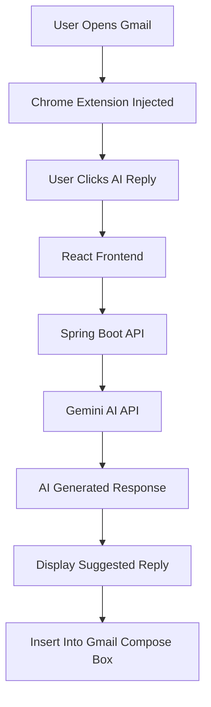
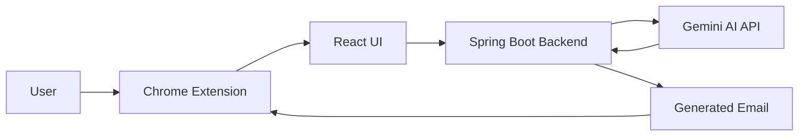
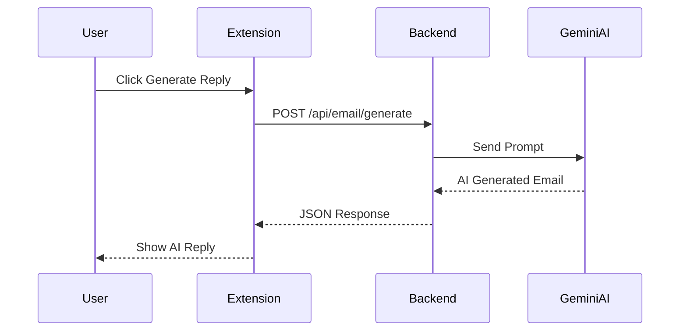

# ✉️ Email Assistant AI

<div align="center">


### 🚀 AI-powered Email Writing Assistant built using Spring Boot, React & Gemini AI

Generate professional email replies instantly inside Gmail with AI-powered suggestions, tone customization, and seamless browser integration.

[Live Demo](#) • [Features](#-features) • [Installation](#-installation) • [Architecture](#-system-architecture)

</div>

---

# 📸 Preview

## ✨ AI Email Generation Flow



---

# 🧠 System Architecture



---

# 🔁 Sequence Diagram



---

# ✨ Features

* 🤖 AI-powered email generation
* ✍️ Professional email replies
* 🎭 Tone customization
* ⚡ Instant response generation
* 🌐 Gmail integration
* 🧩 Chrome extension support
* 🔒 Secure backend API
* 📦 RESTful architecture
* 🎨 Modern UI
* 🚀 Fast and lightweight

---

# 🛠 Tech Stack

## Backend

* Java 21
* Spring Boot
* Spring Web
* REST APIs

## Frontend

* React.js
* Tailwind CSS

## AI

* Google Gemini API

## Browser Extension

* Chrome Extension APIs

## Build Tools

* Maven
* npm

---

# 📂 Project Structure

```bash
EMAIL-ASSISTANT/
│
├── backend/
│   ├── src/
│   ├── controller/
│   ├── service/
│   ├── dto/
│   ├── config/
│   └── application.properties
│
├── frontend/
│   ├── src/
│   ├── components/
│   ├── pages/
│   └── services/
│
├── extension/
│   ├── manifest.json
│   ├── content.js
│   ├── popup.js
│   └── styles/
│
├── screenshots/
├── README.md
└── LICENSE
```

---

# 🚀 How It Works

1️⃣ User opens Gmail

2️⃣ Chrome extension injects AI assistant

3️⃣ User clicks Generate Reply

4️⃣ Email content is sent to Spring Boot backend

5️⃣ Backend communicates with Gemini AI

6️⃣ AI-generated response is returned

7️⃣ Suggested email appears instantly

---

# ⚙️ Installation

## 1️⃣ Clone Repository

```bash
git clone https://github.com/Kuldeepch13/EMAIL-ASSISTANT.git

cd EMAIL-ASSISTANT
```

---

## 2️⃣ Backend Setup

```bash
cd backend

mvn clean install

mvn spring-boot:run
```

---

## 3️⃣ Frontend Setup

```bash
cd frontend

npm install

npm run dev
```

---

## 4️⃣ Configure Gemini API Key

Create `.env` file:

```env
GEMINI_API_KEY=your_api_key_here
```

---

## 5️⃣ Load Chrome Extension

* Open Chrome
* Go to `chrome://extensions`
* Enable Developer Mode
* Click Load Unpacked
* Select `extension/` folder

---

# 📡 API Endpoint

## Generate AI Reply

```http
POST /api/email/generate
```

### Request Body

```json
{
  "emailContent": "Can we schedule a meeting tomorrow?",
  "tone": "Professional"
}
```

### Response

```json
{
  "generatedReply": "Thank you for reaching out. I would be happy to schedule a meeting tomorrow. Please let me know your preferred time."
}
```

---

# 🎭 Supported Tones

* Professional
* Friendly
* Formal
* Casual
* Concise
* Persuasive

---

# 🔒 Security Features

* API validation
* Secure environment variables
* CORS configuration
* Input sanitization

---

# 📈 Future Improvements

* Multi-language support
* Email summarization
* Smart reply suggestions
* User authentication
* Conversation history
* AI personalization
* Outlook support
* Response analytics

---

# 🧪 Future Enhancements

* Docker support
* Redis caching
* JWT Authentication
* WebSocket real-time updates
* Deployment on Render/Vercel

---

# 🤝 Contributing

Contributions are welcome.

### Steps

1. Fork repository
2. Create feature branch
3. Commit changes
4. Push changes
5. Open Pull Request

---

# ⭐ Support

If you found this project useful, consider giving it a ⭐ on GitHub.

---

# 📄 License

This project is licensed under the MIT License.
